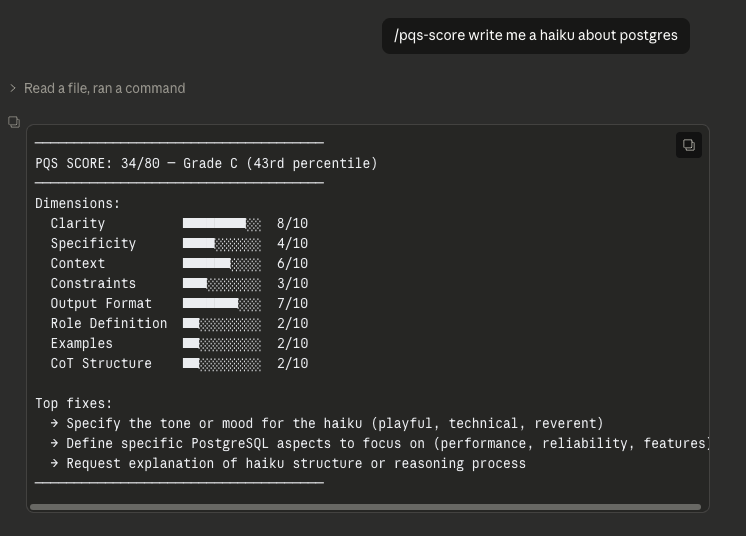

# pqs-claude-commands

> **Your prompts are failing before you hit enter. You just can't see it yet.**
>
> `/pqs-score` runs a pre-flight quality check on any prompt — right from Claude Code — before you waste an inference call on a bad input.

Public giveaway repo for the **`/pqs-score`** Claude Code slash command — score
any prompt against [PQS (Prompt Quality Score)](https://pqs.onchainintel.net)
right from your terminal.

## Example output

This is an actual `/pqs-score` run from inside Claude Code — the slash command
read the API key from `~/.pqs/config`, POSTed the prompt to
`pqs.onchainintel.net/api/score`, and rendered the response:



"Write a haiku about postgres" lands at a C — clear enough that the model will
respond, but wide open on the dimensions that actually determine output quality:
no tone, no angle on what's interesting about Postgres, no role, no reasoning
scaffold. Every run will give you a different haiku, because the prompt isn't
telling the model what "good" looks like. PQS surfaces those gaps in under a
second, before you waste the inference call.

<details>
<summary>Raw text version of the same output (for copy-paste)</summary>

```
─────────────────────────────────────
PQS SCORE: 34/80 — Grade C (43rd percentile)
─────────────────────────────────────
Dimensions:
  Clarity          ████████░░  8/10
  Specificity      ████░░░░░░  4/10
  Context          ██████░░░░  6/10
  Constraints      ███░░░░░░░  3/10
  Output Format    ███████░░░  7/10
  Role Definition  ██░░░░░░░░  2/10
  Examples         ██░░░░░░░░  2/10
  CoT Structure    ██░░░░░░░░  2/10

Top fixes:
  → Specify the tone or mood for the haiku (playful, technical, reverent)
  → Define specific PostgreSQL aspects to focus on (performance, reliability, features)
  → Request explanation of haiku structure or reasoning process
─────────────────────────────────────
```

</details>

## Install (one line)

**Requires Claude Code.**

```bash
curl -fsSL https://pqs.onchainintel.net/install.sh | bash
```

That will:

1. Compute a machine fingerprint (sha256 of hostname + user + OS — no personal
   info leaves your machine beyond this hash).
2. Call `POST /api/keys/generate` on the PQS API to mint (or recover) a free
   `PQS_*` API key tied to that fingerprint.
3. Write the key to `~/.pqs/config` with mode `600`.
4. Copy the `/pqs-score` slash command into `~/.claude/commands/` if Claude
   Code is installed.

Re-running the installer on the same machine returns the same key — the
fingerprint lookup is idempotent server-side.

## Usage

Inside any Claude Code session:

```
/pqs-score write a haiku about postgres
```

The command reads your key from `~/.pqs/config`, POSTs the prompt to
`https://pqs.onchainintel.net/api/score` with the
`Authorization: Bearer <key>` header, and prints grade, score, percentile, an
8-dimension breakdown (clarity, specificity, context, constraints, output
format, role definition, examples, CoT structure), and three actionable fixes
from the response.

## What's in this repo

```
install.sh                       — the installer
.claude/commands/pqs-score.md    — the slash command itself
README.md                        — this file
```

## Privacy

- The fingerprint is a one-way sha256 hash. The server cannot reverse it.
- Prompts you score are logged server-side for quality analytics (the public
  PQS dataset). Don't send secrets.
- Email is never required for the fingerprint flow.

## Free tier

Each key gets `monthly_limit: 1000` scoring calls. Usage is tracked
(`usage_count`, `last_used_at`) and enforced by `lib/validateApiKey.js` in
the PQS app.

## Manual install (if you don't trust `curl | bash`)

```bash
git clone https://github.com/onchainintel/pqs-claude-commands.git
cd pqs-claude-commands
bash install.sh
```

Or fully manual:

```bash
mkdir -p ~/.claude/commands
cp .claude/commands/pqs-score.md ~/.claude/commands/

# mint a key
FP="sha256:$(printf '%s|%s|%s' "$(hostname)" "$(id -un)" "$(uname -s)" | shasum -a 256 | awk '{print $1}')"
KEY=$(curl -sS -X POST https://pqs.onchainintel.net/api/keys/generate \
  -H 'Content-Type: application/json' \
  -d "{\"fingerprint\":\"$FP\"}" | sed -n 's/.*"key":"\([^"]*\)".*/\1/p')

mkdir -p ~/.pqs && chmod 700 ~/.pqs
printf 'PQS_API_KEY=%s\nPQS_API_BASE=https://pqs.onchainintel.net\n' "$KEY" > ~/.pqs/config
chmod 600 ~/.pqs/config
```

## Quick test once deployed

```bash
# Mint a key for a test fingerprint
curl -sS -X POST https://pqs.onchainintel.net/api/keys/generate \
  -H 'Content-Type: application/json' \
  -d '{"fingerprint":"sha256:abcdef0123456789abcdef0123456789abcdef0123456789abcdef0123456789"}'
# -> {"key":"PQS_...","tier":"free","monthly_limit":1000,"existing":false}

# Re-posting the same fingerprint returns the SAME key (existing:true)
curl -sS -X POST https://pqs.onchainintel.net/api/keys/generate \
  -H 'Content-Type: application/json' \
  -d '{"fingerprint":"sha256:abcdef0123456789abcdef0123456789abcdef0123456789abcdef0123456789"}'
# -> {"key":"PQS_<SAME>","tier":"free","monthly_limit":1000,"existing":true}

# Use the key to score a prompt
curl -sS -X POST https://pqs.onchainintel.net/api/score \
  -H "Authorization: Bearer PQS_..." \
  -H 'Content-Type: application/json' \
  -d '{"prompt":"write a haiku about postgres"}'
```
